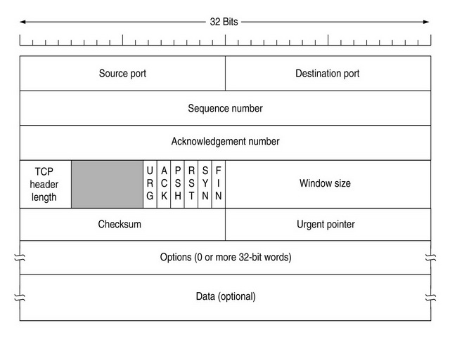

### Общие требования:
1. Все лабораторные сдаются одновременно на 2+ машинах, то есть
   демонстрируется работа в реальной сети. Сдавать с использованием
   виртуальных машин возможно только в порядке индивидуального
   согласования.
2. Код функций должен быть коротким и содержать только суть выполняемых
   действий. Каждая фунция (метод класса) должна выполнять только одно
   понятное, простое и законченное действие, которое ясно из ее названия.
   При необходимости выполнить несколько действий, необходимо каждое из
   них вынести в отдельную функцию. Максимальная сложность функции
   должна быть ограничена 10-15 действиями и весь ее код должен вмещаться
   в 60 строк
3. Реализации лабораторных работ должны быть кросплатформенными. То
   есть один и тот же код должен компилироватся и работать как в Windows
   так и в одной из *nix систем на выбор: Linux, BSD, Mac OS X. 
4. Стиль написания кода.
   Неправильный способ написания:
   ```
   #if WINDOWS
   WSAConnect(s);
   #elif UNIX
   connect(s);
   #endif
   ```
   Правильный способ:
    ```
   Connect(s);
   /*А уже внутри функции разбираться что вызывать и когда*/ 
   ```
Важные замечания по реализации ЛР:
1. Следует обратить внимание, что каждая последующая ЛР включает в себя
функциональность предыдущей.
2. Тот процесс который принимает входящие подключения условно
   называется “сервером”. “Сервер”, вне зависимости от вида, должен
   поддерживать возможность работы с несколькими клиентами. То есть при
   отключении “клиента”, сервер должен иметь возможность принять и
   обслужить другого клиента без своего перезапуска. Завершение работы
   сервера без явной команды на это действие будет считаться ошибкой
   реализации.
3. Основные понятия. **Последовательный сервер** - сервер исполняющий комманды (запросы)
   клиента исключительно последовательно. Если сервер не поддерживает
   одновременную работу с несколькими клиентами, то их запросы на
   подключение он должен отвергать.
Основные ошибки в реализации:
1. Попытка чтения всех данных из TCP сокета за один вызов может привести к
   тому, что будет прочитана лишь часть из них (так как другая часть могла
   еще не дойти). TCP гарантирует передачу потока байт, но не имеет
   встроенных средств для выделения границ сообщений, то есть не
   гарантирует прием данных в recv именно такими “порициями”, как они были
   “отправлены” (записаны в сокет с помощью вызова send). Реализация
   выделения границ сообщения (окончания комманды, строки и т.д.) ложится
   на программиста.
2. В случае работы с протоколом UDP, для организации надежной доставки
   необходимо организовывать какое-либо подтверждение. Однако
   реализация “в лоб” (с ожиданием подтверждения для каждого
   отправленного UDP пакета) будет приводить к существенному снижению
   производительности.
3. Отправка неоправданно малого количества байт в одном UDP пакете
   приведет к существенному оверхеду, что так же не позволит выполнить
   требования по скорости передачи и оверхеду. Среднее значение оверхеда
   должно быть не более 30% за всю сессию. (Оверхед (overhead) - это
   накладные расходы которые будут затрачены на выполнение полезной
   работы. В частности к работе с протоколами TCP/UDP - это размер
   служебных данных по отношению к полезным. Под служебными данными
   подразумеваются:
   - i. заголовки IP,UDP/TCP,
   - ii. служебные пакеты ASK, SYN и т.д.
   - iii. данные используемые программой для правильного выполнения,
   такие как: номер пакета, размер файла, ответные пакеты
   подтверждение приема (включая размер всех заголовков) и т.д.
4. Чтение или запись данных в сокет очень малыми порциями (например по 1
   байту). Это приводит сущесвенной нагрузке на CPU за счет частого
   переключения контекста между ядром и процессом.
   
## Лабораторная работа №1
   Знакомство с программированием сокетов.

   ВАЖНО: Выбор языка программирования осуществлять с учетом своего варианта
   на л.б. №4

   Необходимо реализовать простейшую программу-сервер с использованием
   протокола TCP. Сервер должен поддерживать выполнение нескольких команд,
   определяемых на усмотрение студента, но как минимум должен поддерживать
   выполнение следующих (или аналогичных):
   - ECHO(возвращает данные переданные клиентом после команды),
   - TIME(возвращает текущее время сервера),
   - CLOSE(EXIT/QUIT) (закрывает соединение).

   Команда может иметь параметры (например ECHO). Любая команда должна
   оканчиваться символами \r\n или \n.

   В качестве клиента предполагается использование системных утилит: telnet, netcat
   и других. Возможно использование собственной программы клиента, но это является не
   обязательным.

   Продемонстрировать использование утилит: nmap -- сканирование портов
   сервера, netstat -- список открытых сокетов на сервере, номера портов.

   ### Клиент серверная программа для передачи файла по сети с использованием протокола TCP

   Необходимо реализовать клиент и последовательный сервер, позволяющие
   обмениваться файлами. Сервер должен продолжать поддерживать команды, которые
   были реализованы в предыдущей части, добавляя к этому команду передачи файла.
   Запрос на закачку файла на сервер или скачивание с него, должен иницировать клиент.
   Команды могут быть к примеру UPLOAD/DOWNLOAD. Решать проблемы связанные с тем
   что такого файла нет (например мы хотим скачть файл с сервера, но не знаем каково его
   имя), не нужно, достаточно вывести сообщение, что файла с запрашиваемым именем
   нет.

   После завершения передачи вывести битрейт (скорость передачи данных).
   
   Файлы должны передаваться с помощью протокола TCP. Реализация должна
   учитывать возможные исключительные ситуации, связанные с проблемами сети, такие
   как физический или программный обрыв соединения.

   Алгоритм определения разрыва соединения может быть любым, но таким, чтобы
   пользователь смог узнать об этом в разумное время (от 30 секунд до 2-5 минут). До
   вывода сообщения о наличии проблем с соединением программа должна
   восстанавливать передачу файла самостоятельно (необходимо сконфигурировать
   параметр сокета SO_KEEPALIVE для точного контроля интервала удержания соединения
   в программе или в настройках ОС -- для Windws см. Things that you may want to know about
   TCP Keepalives) . Если же сообщение о проблеме уже выведено, то решение о попытке
   восстановления должен принимать пользователь.

   Сервер обязан поддерживать восстановление докачивания/скачивания файла.
   Допускаются следующие ограничения: докачка осуществляется если после
   восстановления соединения подключился тот же клиент и пытается докачать/скачать
   тот же файл, что и в прошлую сессию. Если успел подключится другой клиент, или
   сервер был перезапущен, то сервер имеет полное право удалить файлы (и данные
   сессии) относящиеся к незавершенным загрузкам.

   Сервер и клиент обязаны работать в рамках одного потока

   ### Необязательно: Изучение внеполосного режима передачи данных.
   Модификация программы:
   Во время передачи данных с использованием протокола TCP, передающая
   сторона должна генерировать внеполосные данные (например процент переданных
   данных от общего количества) и выводить на экран общее количество переданных байт
   данных (не включая срочные), принимающая сторона должна выводить на экран общее
   количество принятых байт (не включая срочные), а при получении срочных данных --
   выводить их.

   ### Вопросы:
5. Установление и разрыв соединения на уровне протокола TCP
6. Скользящее окно передачи данных в протоколе TCP: назначение, механизм
   функционирования
7. Механизм медленного старта
8. Алгоритм Нэгла (Nagle) преимущества и недостатки
9. Срочные данные в TCP: механизм применения, ограничения.

### Структура TCP пакета

